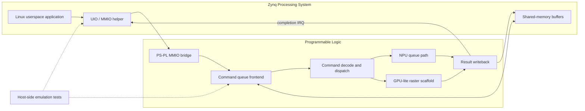

# RISC-V / Accelerator Platform on Zybo Z7-10

[](https://github.com/fanguoc2len/RISC-V-computer-ZYBO/actions/workflows/host-emulation.yml)

This repository is the second branch of the project family. Unlike the Basys 3
repo, this one is **not** a text-mode mini computer for Artix-7 bring-up. It is
a `Zybo Z7-10` platform that moves toward:

- `Linux` on the `Zynq PS`
- accelerator logic in the `PL`
- MMIO / unified-memory / command-queue infrastructure
- future `NPU v2` and `GPU 3D lite` execution paths

In short:

- `RISC-V-computer` = Basys 3 / Artix-7 mini computer
- `RISC-V-computer-ZYBO` = Zynq / Zybo accelerator platform

## Hardware Target

- Board: `Digilent Zybo Z7-10`
- SoC: `Zynq-7000`
- Part: `xc7z010clg400-1`
- Current top shell: `rtl/top/zybo_z7_10_accel_shell.v`

## Project Goal

The long-term target is a heterogeneous platform where:

- the `PS` runs Linux
- the `PL` hosts accelerator infrastructure
- software submits work through MMIO and shared-memory queues
- NPU and GPU-style blocks evolve beyond the small Basys-era test logic

This is why the repository still keeps some legacy PicoRV32 blocks: they are
useful scaffolding while the migration is in progress.

## System Architecture



The diagram shows the intended PS/PL data path. The MMIO, queue, accelerator
stubs, writeback path, and host emulation exist today; full Linux and
hardware-board validation remain roadmap items.

## Current Status

This repository is currently a **foundation scaffold** with meaningful
verification, not yet a finished Linux-on-board product.

Already implemented:

- Zybo-specific Vivado project creation
- `PL-first` accelerator shell
- PS/PL block-design generation scripts
- MMIO bridge scaffold
- unified-memory queue scaffolding
- NPU queue-path stubs and writeback stubs
- GPU-lite raster stub path
- host-side userspace emulation and regression checks
- Linux UIO-side helper code and command-queue host tests

Not done yet:

- fully validated exported XSA on hardware
- full Linux boot and driver bring-up on board
- DMA-centered production data path
- completed end-to-end AI model execution on real hardware
- completed 3D graphics pipeline

## Repository Layout

```text
rtl/
  top/zybo_z7_10_accel_shell.v   PL-first shell
  top/zybo_z7_10_ps_pl_top.v     PS/PL integration module
  accel/                         accelerator and queue scaffolding
  soc/                           legacy PicoRV32 subsystem kept for migration

linux/
  uio/                           host-side demo and queue producer checks
  devicetree/                    UIO-related DTS fragments

scripts/
  create_vivado_zybo_project.tcl
  create_vivado_zybo_ps_project.tcl
  export_zybo_ps_xsa.tcl
  run_vivado_zybo_*.tcl          focused accelerator regressions

docs/
  architecture, migration, MMIO map, unified-memory notes, roadmap
```

## Quick Start

### 1. Create the Zybo Vivado project

```tcl
cd <repo-path>
source scripts/create_vivado_zybo_project.tcl
```

This creates the project for `xc7z010clg400-1`, adds the RTL sources, and sets
`zybo_z7_10_accel_shell` as the synthesis top.

### 2. Build the PL-first shell

```bat
scripts\run_vivado_build.bat
```

Expected bitstream:

```text
build\vivado_zybo\riscv_computer_zybo_z7_10.runs\impl_1\zybo_z7_10_accel_shell.bit
```

### 3. Program the shell

```bat
scripts\program_zybo_accel_shell.bat
```

Compatibility note: legacy `program_basys3.*` scripts are still present as
aliases so old habits do not break, but the correct Zybo-oriented entry point is
`program_zybo_accel_shell.bat`.

### 4. Generate the PS/PL handoff

```tcl
source scripts/export_zybo_ps_xsa.tcl
```

Expected output:

```text
build/hw/zybo_z7_10_ps_pl.xsa
```

### 5. Run host-side checks

```sh
make -C linux/uio clean all
make -C linux/uio check-emulate
make -C linux/uio check-emulate-irq
make -C linux/uio check-cmdq-host
```

These checks are especially useful when hardware access is limited.

## Vivado Regression Entry Points

Focused simulation entry points are available for the accelerator path:

- `scripts/run_vivado_zybo_accel_mmio_sim.tcl`
- `scripts/run_vivado_zybo_cmdq_frontend_sim.tcl`
- `scripts/run_vivado_zybo_umem_axi_fetch_sim.tcl`
- `scripts/run_vivado_zybo_cmdq_decode_sim.tcl`
- `scripts/run_vivado_zybo_cmdq_dispatch_sim.tcl`
- `scripts/run_vivado_zybo_npu_payload_fetch_sim.tcl`
- `scripts/run_vivado_zybo_npu_exec_sim.tcl`
- `scripts/run_vivado_zybo_npu_result_store_sim.tcl`
- `scripts/run_vivado_zybo_npu_queue_path_sim.tcl`
- `scripts/run_vivado_zybo_npu_queue_payload_path_sim.tcl`
- `scripts/run_vivado_zybo_npu_queue_writeback_path_sim.tcl`
- `scripts/run_vivado_zybo_npu_queue_runtime_mlp_sim.tcl`

Each one is meant to verify one slice of the accelerator stack instead of
pretending the whole hardware/software platform is finished.

## Verification That Already Passes

The repository already has useful, repeatable host-side proof points:

- Python reference scripts compile and run
- userspace demo builds cleanly
- emulated MMIO regression passes
- emulated IRQ regression passes
- command-queue host producer regression passes

That makes the repo much more credible than a pure scaffold with no runnable
checks.

## How This Repo Relates To The Basys Repo

Some legacy files remain on purpose:

- `top_basys3.v`
- `constraints/basys3_top.xdc`
- `monitor_shell_tb`
- boot ROM / UART / SPI / PS2 scaffolding

They are still useful as migration references. The board target of this repo,
however, is **Zybo Z7-10**, not Basys 3.

More detail:

- [docs/MIGRATION_FROM_BASYS3.md](docs/MIGRATION_FROM_BASYS3.md)
- [docs/ARCHITECTURE_ZYBO.md](docs/ARCHITECTURE_ZYBO.md)
- [docs/ACCEL_COMMAND_QUEUE.md](docs/ACCEL_COMMAND_QUEUE.md)
- [docs/UNIFIED_MEMORY.md](docs/UNIFIED_MEMORY.md)

## Vivado Environment Notes

Batch scripts try to locate Vivado in this order:

1. `VIVADO_BIN`
2. `%XILINX_VIVADO%\bin`
3. `PATH`
4. fallback local `E:\AMDDesignTools\2025.2\Vivado\bin`

## Project Summary

In summary:

> This repo is my Zybo Z7-10 migration track. Instead of building another small
> FPGA computer, I am moving toward a Linux-on-PS plus accelerator-in-PL design,
> with MMIO, unified-memory queue flow, host-side emulation, and focused Vivado
> regressions for the NPU/GPU path.
